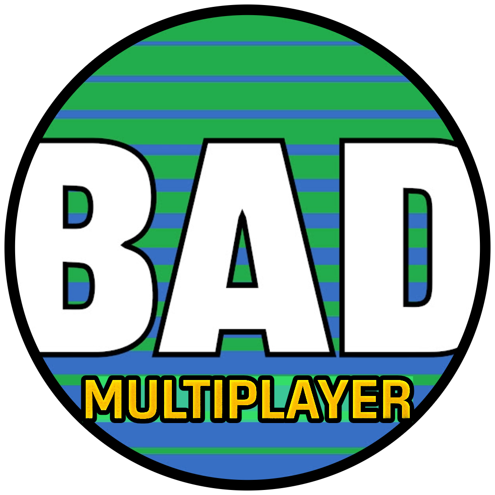

### BAD Multiplayer
Minimizes networking setup for your Godot multiplayer game. 

# Features
- Shared entry point for hosting or joining a game, regardless of network type.
- Currently designed for match based multiplayer games, but is highly configurable.
- Networking lifecycle signals and menu actions are exposed through a simple set of functions.
- Facilitates common match actions like readying a player, spawn point retrieval, respawning, and player reset.
- Build your menus around the networks you want to support.
- Connect buttons signals to the provided host and join game functions.

## Supported networks
- ENet (local and dedicated server)
- Noray Client-host P2P (coming soon!)
- Offline 

# Setup

- [Add this plugin to your Godot multiplayer project](https://godotengine.org/asset-library/asset/4123)

# Getting Started

- https://github.com/BatteryAcid/bad-multiplayer-plugin/wiki/Getting-Started

# Examples

Currently there are two example implementations in the [example folder](https://github.com/BatteryAcid/bad-multiplayer-plugin/tree/main/examples):  
- [getting_started](https://github.com/BatteryAcid/bad-multiplayer-plugin/tree/main/examples/getting_started): simpliest demonstration of multiplayer functionality. Start here!
- [basic_multiplayer](https://github.com/BatteryAcid/bad-multiplayer-plugin/tree/main/examples/basic_multiplayer): more advanced example that includes network selection and the use of BADMatchActions. 
> To run them, open the `main_menu` scene of the respecitive example, and hit the `Run Current Scene` icon.

# Roadmap

- Add support for Steam through steam-multiplayer-peer

# Customization notes

- If you wish to replace one of the provided autoloaders, like `bad_multiplayer_manager`, be sure
to override the public facing functions, like `exit_gameplay_load_main_menu`, as other autoloaders
may call to them.

# Attributions

Portions of this plugin relied heavily on the work done by the folks over at [@foxssake](https://github.com/foxssake), creators of [Netfox](https://github.com/foxssake/netfox) & [Noray](https://github.com/foxssake/noray), and specifically @elementbound for his contributions to improving Godot networking and multiplayer! Thank you!
